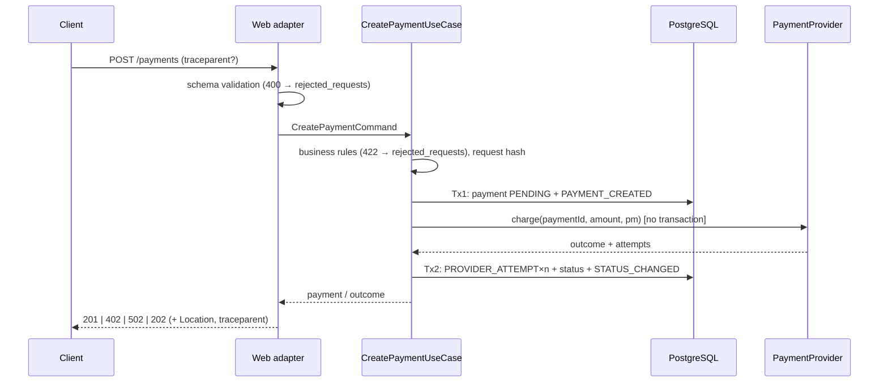

# 001. Payment core — plan

Spec: [spec.md](spec.md)

## Approach
Hexagonal slice through all layers, contract-first:
`api/openapi.yaml` → generated interface + DTOs → web adapter → `CreatePaymentUseCase` / `GetPaymentQuery` → domain
(`Payment`, state machine) → ports `PaymentRepository`, `PaymentJournal`, `PaymentProvider` → adapters (JPA, fake).
Every status change goes through `PaymentStatusApplier`. The use case controls transactions explicitly with
`TransactionTemplate` (Tx 1 → provider call → Tx 2) instead of `@Transactional`, so the "no transaction during the
provider call" rule is visible in code and testable (AC-13).

## Components (packages and classes)
Root `io.github.bsamsonov.paymentservice`; every package has `package-info.java` with `@NullMarked`.

| Package | Classes | Notes |
|---|---|---|
| `domain` | `Payment` (aggregate), `PaymentId` (UUIDv7), `Money`, `CurrencyPolicy`, `PaymentStatus` (transition table), `FailureCode`, `PaymentEvent` (+ `EventType`, `ActorType`, `EventSource`), `ProviderOutcome` (sealed: `Succeeded`, `Declined(code, providerCode)`, `Rejected`, `Unknown`), `ProviderAttempt`, `TransitionResult` (`Applied`, `NoOp`, `Rejected`) | no Spring/JPA/Jackson; `Clock` passed in |
| `application` | `CreatePaymentUseCase`, `GetPaymentQuery`, `PaymentStatusApplier`, `RejectedRequestRecorder`, `RequestHasher` (canonical JSON → SHA-256), `CreatePaymentCommand`, `BusinessRuleViolation` (collects all 422 errors), ports `PaymentRepository`, `PaymentJournal`, `PaymentProvider`, `RejectedRequestLog`, `TraceContext` | may use `spring-tx` (`TransactionTemplate`) only |
| `adapter.in.web` | `PaymentsController` (implements generated `PaymentsApi`), `PaymentWebMapper`, `ProblemDetailsHandler` (`@RestControllerAdvice`, extends `ResponseEntityExceptionHandler`), `TraceparentResponseFilter`, `FailureMessages` (dictionary) | generated code in `adapter.in.web.api` / `.model` |
| `adapter.out.persistence` | `PaymentEntity`, `PaymentEventEntity` (`@Immutable`), `RejectedRequestEntity` (`@Immutable`), Spring Data repositories (no delete methods), `JpaPaymentRepository`, `JpaPaymentJournal`, `JpaRejectedRequestLog`, mappers | domain ↔ entity mapping; entities never leave the adapter |
| `adapter.out.provider.fake` | `FakePaymentProvider` | `@ConditionalOnProperty(payments.provider=fake)`; table from spec |
| `adapter.out.tracing` | `MicrometerTraceContext` | current trace id from Micrometer `Tracer` |
| `config` | `PaymentsProperties` (`@ConfigurationProperties`: provider, currency allow-list, min/max), `ClockConfig`, `TransactionConfig` | |

Status applier algorithm (AC-10, AC-11, AC-14): load payment → `payment.apply(target, data)` returns
`Applied | NoOp | Rejected` → for `Applied`/`Rejected` append event with `sequence_no = ++last_event_seq` → save →
commit. On `ObjectOptimisticLockingFailureException`: re-read and re-apply, at most 3 attempts, then fail loudly
(ERROR log; the payment stays in its last committed state).

## Data model and migrations
Flyway, `src/main/resources/db/migration`:
- `V1__payments.sql` — `payments` per spec; checks `amount > 0`, `0 <= refunded_amount <= amount`,
  `currency ~ '^[A-Z]{3}$'` (`varchar(3)`, not `char(3)`: Hibernate expects `varchar` for `String`); index `(external_reference, created_at DESC)`.
- `V2__payment_events.sql` — `payment_events` per spec; FK without cascade; `UNIQUE (payment_id, sequence_no)`;
  function `forbid_append_only_change()` + row and truncate triggers.
- `V3__rejected_requests.sql` — `rejected_requests`, same function and triggers.

JSON columns (`metadata`, `details`, `error_fields`): `jsonb` via Hibernate `@JdbcTypeCode(SqlTypes.JSON)`.
Statuses and enums are stored as `varchar` with `CHECK` constraints (readable in SQL, safe to extend).
Flyway owns the schema; Hibernate runs with `spring.jpa.hibernate.ddl-auto=validate`, so a mismatch between the
entities and the migrated schema (missing table/column, incompatible type) fails startup and every IT.
Local DB: `compose.yaml` with `postgres:17` + `spring-boot-docker-compose` (dev only). Tests: Testcontainers
`postgres:17` via a shared `@TestConfiguration` with `@ServiceConnection`; the existing context tests start using it.

## Sequence

## Transactions and concurrency
- Tx 1 and Tx 2 via `TransactionTemplate`; the provider call between them. `RejectedRequestRecorder` writes in its own
  short transaction (no business transaction exists at that point).
- Optimistic locking (`@Version`) on `payments`; `last_event_seq` makes every journal write bump the version, so
  sequence numbers never collide.
- No pessimistic locks. Retry of the applier only (bounded, re-reads fresh state).
- Hikari pool stays default; virtual threads already enabled — the provider call holds no connection.

## Validation split (400 vs 422)
- Schema-level (generated Bean Validation + strict Jackson): required, types, length, patterns, unknown fields
  (`spring.jackson.deserialization.fail-on-unknown-properties: true`) → `400`.
- Business limits are **not** in the OpenAPI schema as `minimum`/`maximum` (the generator would turn them into
  `@Min`/`@Max` → `400`); they live in `CurrencyPolicy` and produce `422`. The schema documents them in `description`.
- Malformed path UUID → `404` (handler maps `MethodArgumentTypeMismatchException` on `id`).
- `rejected_requests` rows are written by `ProblemDetailsHandler` for every `400`/`422` on any endpoint; `404` is not
  recorded in 001.

## Tracing
`spring-boot-micrometer-tracing-opentelemetry` (Micrometer → OTel bridge), W3C propagation (Boot default), no exporter
(export disabled until 008). `TraceparentResponseFilter` writes the current span's `traceparent` to every response.
Trace id lands in MDC (logs) and in journal rows via the `TraceContext` port.

## Dependencies (to add)
`spring-boot-starter-data-jpa`, `spring-boot-starter-flyway` + `flyway-database-postgresql`, `postgresql`,
`spring-boot-micrometer-tracing-opentelemetry` (exact artifact set verified in T1), `uuid-creator` 6.1.1
(JDK 25 has no UUIDv7 factory — checked), `spring-boot-docker-compose` (optional, dev);
test: `spring-boot-testcontainers`, `testcontainers-postgresql`, `testcontainers-junit-jupiter`.
Plugin: `openapi-generator-maven-plugin` 7.26.0, generator `spring`: `interfaceOnly`, `useSpringBoot4`,
`useJackson3`, `useBeanValidation`, `openApiNullable=false`, `skipDefaultInterface`, `useTags`.
Added in T2: `documentationProvider=none`, `annotationLibrary=none` (no springdoc/swagger annotations),
`generateJsonIncludeAnnotations=true` + `containerDefaultToNull=true` (absent optional fields, including empty
collections, are omitted), `generateSupportingFiles=false`. The generator ignores `servers` with `interfaceOnly`, so
the `/api/v1` prefix is part of each path in the contract.
Generated sources are excluded from Spotless, Error Prone/NullAway, SpotBugs and JaCoCo.

## Test strategy
| AC | Test type | Test class |
|---|---|---|
| AC-1 | IT (real server, Testcontainers) | `CreatePaymentIT` |
| AC-2 | IT, parameterized over 4 payment methods | `CreatePaymentIT` |
| AC-3 | IT + `OutputCaptureExtension` for the ERROR line | `CreatePaymentIT` |
| AC-4 | IT | `CreatePaymentIT` |
| AC-5 | slice `@WebMvcTest`, parameterized (shape, all errors) + 1 IT case for the `rejected_requests` row | `PaymentRequestValidationTest`, `RejectedRequestsIT` |
| AC-6 | unit (`CurrencyPolicyTest`) + slice + 1 IT case | same + `CurrencyPolicyTest` |
| AC-7, AC-8 | IT | `GetPaymentIT` |
| AC-9 | IT | `FindPaymentsByExternalReferenceIT` |
| AC-10 | unit: full transition table; IT: rejected and conflicting duplicate are journaled, identical duplicate is not | `PaymentStatusTest`, `PaymentTest`, `PaymentStatusApplierIT` |
| AC-11 | IT: sequence and snapshot; rollback when the event insert fails (`@MockitoSpyBean` on the journal) | `PaymentStatusApplierIT` |
| AC-12 | IT via `JdbcTemplate` on both journals | `AppendOnlyJournalIT` |
| AC-13 | IT with a recording provider (`isActualTransactionActive()==false`, payment visible via a separate connection) | `ProviderCallTransactionIT` |
| AC-14 | IT: two threads + `CountDownLatch` on one `PROCESSING` payment → one applied, one rejected, no exception | `PaymentStatusApplierIT` |
| AC-15 | IT | `CreatePaymentIT` |
| AC-16 | IT with and without `traceparent` | `TracingIT` |
| AC-17 | unit (canonicalization cases) + IT (column and event) | `RequestHasherTest`, `CreatePaymentIT` |

Traceability (see `specs/README.md`): every test that covers an AC carries the id in `@DisplayName`, e.g.
`@DisplayName("001/AC-2: declined card returns 402")` (several: `"001/AC-10, 001/AC-14: …"`);
`scripts/spec/check-ac-trace.sh` must pass for all 17 AC. The last commit of the PR sets `status: Implemented`.

Architecture (ArchUnit, added now): `domain` depends on no Spring/JPA/Jackson/Hibernate; `application` does not
depend on `adapter..`; adapters do not depend on each other; generated `adapter.in.web.api/model` used only in
`adapter.in.web`; JPA entities only in `adapter.out.persistence`.

## Risks
- **Hibernate 7 JSON mapping with Jackson 3** — Hibernate's JSON `FormatMapper` may need Jackson 2 or a custom
  mapper. Verify first in T3; fallback: `FormatMapper` bean on Jackson 3.
- **openapi-generator + Boot 4 / Jackson 3** options are new; generated code may trip Error Prone/NullAway → exclude
  generated sources (done in T2); if the output is unusable, fall back to hand-written DTOs checked against the
  contract with a contract test.
- **Tracing artifact set in Boot 4** (module vs starter, exporter on by default) — verify in T1; export must be off.
- **Coverage gate 80%** with generated code — excluded from JaCoCo.
- **Scope size**: ~17 AC in one PR. Mitigation: commit per task; if the PR grows beyond review comfort, split tracing
  (AC-16) into a follow-up PR with a spec update.

## ADR links
- ADR-0006 Contract-first API with generated interfaces (in this PR).
- ADR-0007 UUIDv7 identifiers generated in the application (in this PR).
- **ADR-0008 Audit architecture** (new, in this PR): local append-only journal in the same transaction, snapshot +
  `sequence_no`, trigger now / DB roles as production option, why not Envers/CDC/pgAudit/event sourcing, hash chain and
  central store as future options.
- ADR-0002 (stack) already covers PostgreSQL/Flyway/JPA/Testcontainers.
